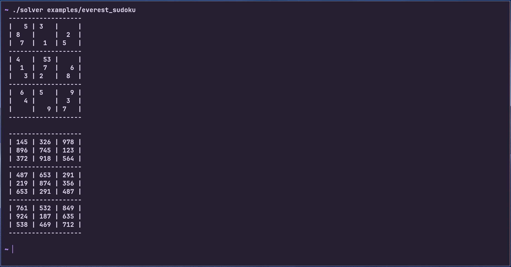

# Sudoku solver in C

It's a tiny program in C that solves Sudoku with backtracking.

## Structure

```text
├── examples
│   ├── everest_sudoku
│   └── sudoku_table
├── game.c
├── game.h
├── images
│   └── screenshot.png
├── main.c
├── Makefile
└── README.md
```

## Build
```bash
make
```

## Usage

```bash
./solver examples/sudoku_table
```
